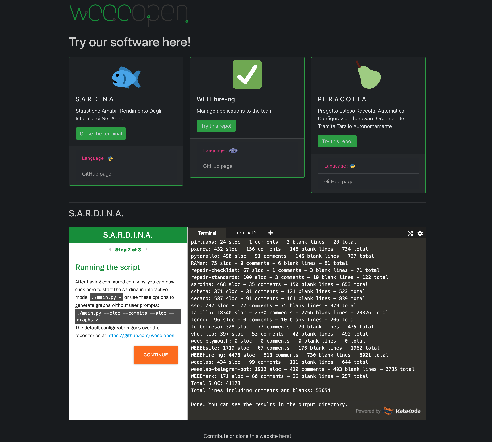

# SoftWEEEre

A website where you can try WEEE Open software directly in the browser.

See a screenshot here:  

Try it for yourself at https://softweeere.caste.dev!

### Run with Docker

`docker build -t softweeere .`  
`docker run -d --name softweeere -p 80:80 softweeere`  
See logs with  
`sudo tail -f $(docker inspect --format='{{.LogPath}}' softweeere)`

### Licensing

"Python" is a registered trademark of the PSF. The Python logos (in several variants) are use trademarks of the PSF as well.  
See the "Uses that Never Require Approval" at [this link](https://www.python.org/psf/trademarks/).

PHP logo made by Colin Viebrock under [Creative Commons Attribution-Share Alike 4.0 International](https://creativecommons.org/licenses/by-sa/4.0/).

Project images are made by [Twitter](https://twemoji.twitter.com), with the following license:  
Copyright 2020 Twitter, Inc and other contributors  
Code licensed under the MIT License: http://opensource.org/licenses/MIT  
Graphics licensed under CC-BY 4.0: https://creativecommons.org/licenses/by/4.0/